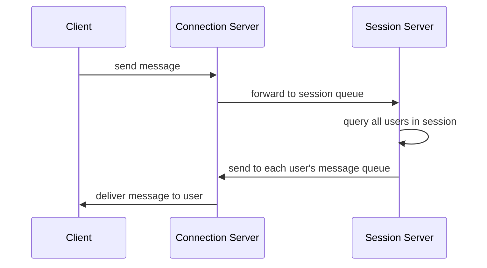

# openchat

## Architecture

## TODO

1. 简化user服务，使用core
2. 完善消息传输逻辑

## License

Copyright (c) caohailong

This project is licensed under the MIT license ([LICENSE] or <http://opensource.org/licenses/MIT>)

[LICENSE]: ./LICENSE
